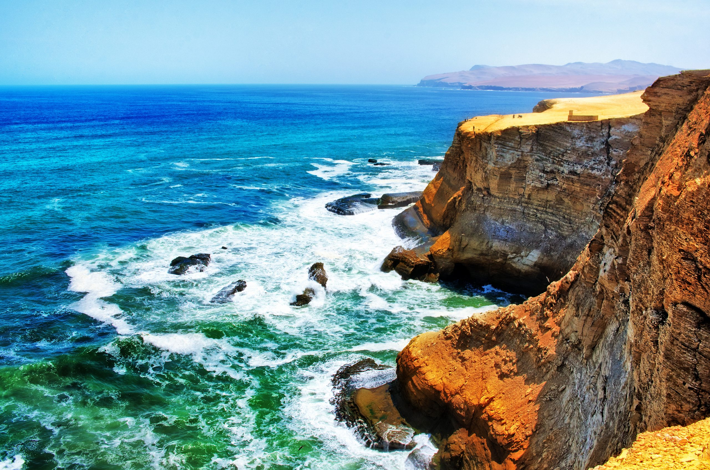

# Guía turistica de Lima

## Descripción

Lima, es una ciudad que fue fundada en 1536

[Wikipedia Lima](https://es.wikipedia.org/wiki/Lima)

Lista de comidas tipicas

1. Ceviche :fire:
   1.1 Ceviche mixto 👨🏻‍💻
2. Lomo Saltado 💀
3. Causa limeña

Lista de lugares turisticos

- Paracas
- Las lineas de Nazca
- 7 Iglesias
- Lomas de Lachay
- Centro Historico

